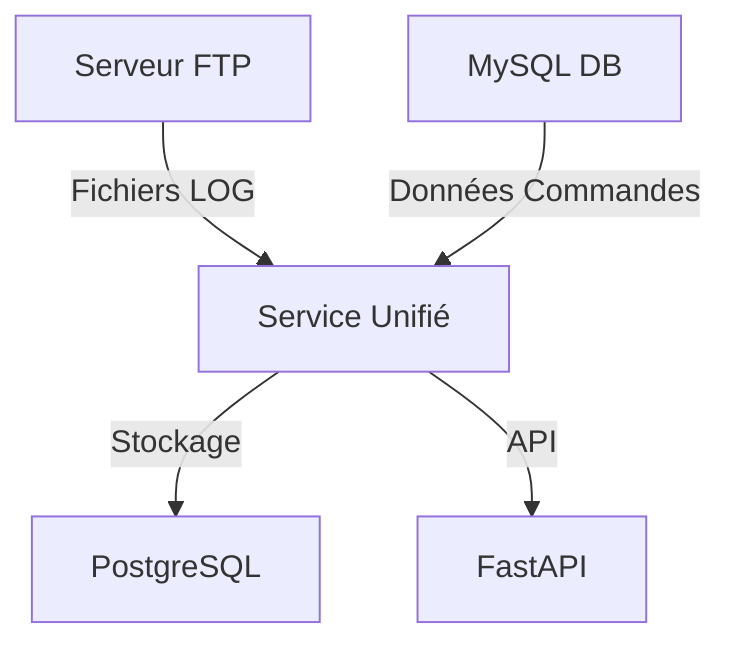

# Rapport de Certification - Système de Gestion des Données de Production Industrielle

## Table des matières
1. Introduction
2. Contexte et Problématique
3. Architecture Technique
4. Implémentation
5. Résultats et Bénéfices
6. Conclusion

## 1. Introduction

Ce rapport présente le développement et l'implémentation d'un système de gestion des données de production pour une entreprise industrielle spécialisée dans la menuiserie. Le projet vise à moderniser la collecte et l'analyse des données de production en centralisant les informations provenant de différents centres d'usinage.

## 2. Contexte et Problématique

### 2.1 Situation Initiale
L'entreprise dispose de trois types de centres d'usinage :
- Centres PVC (DEM12)
- Centres ALU (DEMALU)
- Centres HYBRIDES (SU12)

Ces machines génèrent quotidiennement des fichiers LOG stockés sur un serveur FTP, contenant des informations cruciales sur leur fonctionnement.

### 2.2 Problématiques Identifiées
- Données dispersées entre un serveur FTP et une base MySQL
- Absence de traitement automatisé des fichiers LOG
- Difficulté d'accès aux données historiques
- Manque de visibilité sur les performances machines

### 2.3 Objectifs du Projet
1. Centraliser les données dans une base PostgreSQL
2. Automatiser la collecte et le traitement des logs
3. Développer une API REST pour l'accès aux données
4. Permettre une analyse en temps réel des performances

## 3. Architecture Technique

### 3.1 Vue d'Ensemble
Le système s'articule autour de trois composants principaux :
```
┌─────────────────┐    ┌─────────────────┐    ┌─────────────────┐
│   SERVEUR FTP   │    │     PARSER      │    │   POSTGRESQL    │
│                 │    │                 │    │                 │
│ Reçoit les      │───▶│ Traite les      │───▶│ Stocke les      │
│ fichiers LOG    │    │ logs et calcule │    │ résultats       │
│ des machines    │    │ les métriques   │    │ d'analyse       │
└─────────────────┘    └─────────────────┘    └─────────────────┘
```
Le système s'articule autour de trois composants principaux :
```
                          ┌─────────────────────┐
                          │      Utilisateur    │
                          │   (via Swagger/API) │
                          └────────┬────────────┘
                                   │
                                   ▼
                          ┌─────────────────────┐
                          │     API FastAPI     │
                          │     (uvicorn)       │
                          └────────┬────────────┘
                                   │ Lecture
                                   ▼
                          ┌─────────────────────┐
                          │   PostgreSQL BDD    │
                          │ "production"        │
                          └────────┬────────────┘
                            ▲     ▲
       Écriture via cron    │     │ Écriture via cron
     tous les jours à 4h    │     │ tous les jours à 9h et 14h
                            │     │
                            │     │
        ┌───────────────────┘     └────────────────────┐
        ▼                                              ▼
┌─────────────────────┐                        ┌───────────────────────┐
│ ftp_log_service.py  │                        │ mysql_sync_service.py │
│  → Parsing LOG      │                        │  → Requête SQL        │
│  → Calcul TRS       │                        │  → Accessoires VR     │
│  → Insertion BDD    │                        │  → Insertion BDD      │
└─────────┬───────────┘                        └─────────┬─────────────┘
          │                                              │
          ▼                                              ▼
 ┌──────────────────┐                          ┌────────────────────┐
 │    FTP Server    │                          │     MySQL ERP      │
 │  (fauria/vsftpd) │                          │   (simulation)     │
 └──────────────────┘                          └────────────────────┘

```

### 3.2 Technologies Utilisées
- **Docker et Docker Compose** : Conteneurisation des services
- **Python** : Développement du parser et de l'API
- **FastAPI** : Framework API REST
- **PostgreSQL** : Base de données centrale
- **SQLAlchemy** : ORM pour la gestion des données
- **Cron** : Automatisation des tâches

### 3.3 Structure des Données
Le système gère six tables principales :
1. `centre_usinage` : Informations sur les machines
2. `session_production` : Sessions de production
3. `job_profil` : Profils des jobs
4. `periode_attente` : Périodes d'attente
5. `periode_arret` : Périodes d'arrêt
6. `piece_production` : Pièces produites

## 4. Implémentation

### 4.1 Service de Synchronisation FTP
- Exécution automatique toutes les 15 minutes
- Exploration récursive des dossiers par type de centre
- Traitement des fichiers LOG au format standardisé
- Gestion des variables d'environnement sécurisée

### 4.1.1 Architecture Détaillée du Service FTP

Le service FTP est un composant critique du système qui assure la collecte et le traitement des données de production. Son architecture a été conçue pour être robuste, sécurisée et efficace.

#### Configuration et Sécurité
- **Gestion des Credentials** :
  - Utilisation de variables d'environnement (.env) pour les informations sensibles
  - Séparation stricte des configurations de développement et production
  - Authentification FTP sécurisée avec utilisateur dédié

#### Processus de Synchronisation
1. **Établissement de la Connexion**
   - Connexion au serveur FTP avec gestion des erreurs
   - Vérification de la disponibilité du serveur
   - Logging détaillé des tentatives de connexion

2. **Organisation des Dossiers**
   - Structure hiérarchique par type de centre d'usinage :
     ```
     /
     ├── DEM12 (PVC)/
     ├── DEMALU (ALU)/
     └── SU12 (HYBRIDE)/
     ```
   - Mapping automatique entre dossiers FTP et types de machines

3. **Cycle de Traitement des Fichiers**
   - Scan récursif des dossiers par type de machine
   - Identification des nouveaux fichiers LOG
   - Téléchargement sécurisé en mode binaire
   - Vérification de l'intégrité des fichiers

4. **Gestion des Erreurs et Reprise**
   - Mécanisme de retry en cas d'échec de connexion
   - Journalisation détaillée des erreurs
   - Conservation des fichiers en cas d'échec de traitement
   - Nettoyage automatique après traitement réussi

#### Flux de Données vers PostgreSQL
1. **Préparation des Données**
   - Parsing du contenu des fichiers LOG
   - Validation du format et de la structure
   - Transformation en objets métier

2. **Persistance en Base de Données**
   - Création automatique des tables si nécessaires
   - Transactions atomiques pour garantir l'intégrité
   - Gestion des contraintes d'unicité
   - Calcul des métriques en temps réel

3. **Tables Impactées**
   ```sql
   - centre_usinage
     └── Informations de base des machines
   - session_production
     └── Données agrégées par session
   - job_profil
     └── Détails des profils traités
   - periode_attente
     └── Périodes d'inactivité
   - periode_arret
     └── Arrêts machines
   - piece_production
     └── Détail de chaque pièce
   ```

#### Monitoring et Maintenance
- Logs détaillés de chaque opération
- Métriques de performance du service
- Alertes en cas d'erreurs critiques
- Documentation des procédures de maintenance

Cette architecture garantit une collecte fiable et sécurisée des données de production, tout en assurant leur intégrité lors du transfert vers le système central PostgreSQL.

### 4.1.2 Analyse Technique du Script FTP

Le script `ftp_log_service.py` constitue le cœur du système de collecte et de traitement des données. Son architecture orientée objet et sa conception modulaire en font un composant robuste et maintenable.

#### Structure du Code

```python
class FTPLogService:
    def __init__(self):
        # Configuration via variables d'environnement
        self.ftp_host = os.getenv('FTP_HOST')
        self.db_host = os.getenv('POSTGRES_HOST')
        
        # Mapping des types de machines
        self.cu_directories = {
            'DEM12 (PVC)': 'DEM12',
            'DEMALU (ALU)': 'DEMALU', 
            'SU12 (HYBRIDE)': 'SU12'
        }
```

#### Fonctionnalités Clés

1. **Gestion des Connexions**
   - Connexion FTP sécurisée avec gestion des timeouts
   - Pool de connexions PostgreSQL optimisé
   - Fermeture automatique des ressources

2. **Traitement des Fichiers LOG**
   ```
   Format: YYYYMMDD HH:MM:SS|@EventType: Details
   
   Types d'événements :
   - StukUitgevoerd : Production de pièces
   - MachineWait : Périodes d'attente
   - MachineStop/Start : Cycles d'arrêt
   - JobProfiel : Profils de production
   ```

3. **Analyse des Performances**
   - Calcul en temps réel des métriques
   - Agrégation des données par session
   - Détection des anomalies

4. **Persistence des Données**
   ```sql
   -- Exemple de structure relationnelle
   centre_usinage
      ↓
   session_production
      ↓
   ├── job_profil
   ├── periode_attente
   ├── periode_arret
   └── piece_production
   ```

#### Mécanismes de Sécurité

1. **Protection des Données**
   - Validation des entrées
   - Échappement des caractères spéciaux
   - Prévention des injections SQL

2. **Gestion des Erreurs**
   ```python
   try:
       # Opérations critiques
   except Exception as e:
       logger.error(f"❌ Erreur: {e}")
       self.conn.rollback()
   finally:
       self.close_connections()
   ```

3. **Transactions Atomiques**
   - Commit uniquement après succès complet
   - Rollback automatique en cas d'erreur
   - Préservation de l'intégrité des données

#### Optimisations Techniques

1. **Performance**
   - Traitement par lots des enregistrements
   - Mise en cache des requêtes fréquentes
   - Indexation optimisée des tables

2. **Mémoire**
   - Streaming des fichiers volumineux
   - Nettoyage périodique des ressources
   - Gestion efficace des buffers

3. **Réseau**
   - Compression des données transmises
   - Retry automatique sur échec réseau
   - Timeouts configurables

#### Monitoring et Maintenance

1. **Logging Avancé**
   ```python
   logging.basicConfig(
       level=logging.INFO,
       format='%(asctime)s - %(levelname)s - %(message)s'
   )
   ```

2. **Métriques de Performance**
   - Temps de traitement par fichier
   - Taux de succès/échec
   - Utilisation des ressources

3. **Maintenance Préventive**
   - Détection des fichiers corrompus
   - Nettoyage automatique des logs
   - Alertes sur dysfonctionnements

#### Cycle de Vie des Données

1. **Acquisition**
   ```mermaid
   graph TD
      A[Fichier LOG sur FTP] -->|Téléchargement| B[Validation Format]
      B -->|Parse| C[Extraction Événements]
      C -->|Analyse| D[Calcul Métriques]
      D -->|Sauvegarde| E[PostgreSQL]
      E -->|Nettoyage| F[Suppression FTP]
   ```

2. **Traitement**
   - Validation du format
   - Extraction des événements
   - Calcul des métriques
   - Agrégation des données

3. **Persistence**
   - Sauvegarde structurée
   - Indexation automatique
   - Archivage configurable

Cette architecture technique garantit :
- Une haute disponibilité du service
- Une intégrité totale des données
- Une maintenance facilitée
- Une évolutivité du système

### 4.2 Parser de Logs
Le parser analyse quatre types d'événements principaux :
- `StukUitgevoerd` : Production de pièces
- `MachineWait` : Périodes d'attente
- `MachineStop/Start` : Cycles d'arrêt/démarrage
- `JobProfiel` : Caractéristiques des jobs

### 4.3 API REST
L'API expose les fonctionnalités suivantes :
- Gestion CRUD des centres d'usinage
- Consultation des sessions de production
- Accès aux données détaillées (jobs, attentes, arrêts)
- Statistiques de production

### 4.4 Sécurité et Robustesse
- Isolation des services via Docker
- Gestion sécurisée des credentials
- Journalisation des opérations
- Gestion des erreurs et reprises

### 4.1.3 Service de Synchronisation Unifié

Le système implémente un service de synchronisation unifié (`unified_sync_service.py`) qui coordonne la collecte des données depuis trois sources principales :

1. **Serveur FTP** : Collecte des fichiers LOG des machines
2. **Base MySQL** : Extraction des données de commandes
3. **Base PostgreSQL** : Stockage centralisé des données

#### Architecture du Service



#### Synchronisation MySQL

Le service `mysql_sync_service.py` gère spécifiquement la synchronisation des données de commandes :

```python
class MySQLSyncService:
    def __init__(self):
        # Configuration des connexions
        self.mysql_config = {
            'host': os.getenv('MYSQL_HOST'),
            'user': os.getenv('MYSQL_USER'),
            'password': os.getenv('MYSQL_PASSWORD'),
            'database': os.getenv('MYSQL_DB')
        }
        
        self.pg_config = {
            'dbname': os.getenv('POSTGRES_DB'),
            'user': os.getenv('POSTGRES_USER'),
            'password': os.getenv('POSTGRES_PASSWORD'),
            'host': os.getenv('POSTGRES_HOST')
        }
```

Le service effectue les opérations suivantes :
1. Connexion à la base MySQL source
2. Extraction des commandes avec volets roulants
3. Transformation des données
4. Insertion dans PostgreSQL

#### Modèles de Données

Les principales tables synchronisées sont :

- `A_Kopf` : Informations principales des commandes
- `A_Logbuch` : Journal des modifications
- `P_Zubeh` : Accessoires et composants
- `A_Vorgang` : Opérations de production

#### Planification des Synchronisations

Le service utilise APScheduler pour planifier les synchronisations :

- Synchronisation FTP : Toutes les 15 minutes
- Synchronisation MySQL : Une fois par jour (configurable)
- Vérification des erreurs : Toutes les heures

#### Gestion des Erreurs

Le système implémente une gestion robuste des erreurs :

1. **Logging détaillé** :
   ```python
   logging.basicConfig(
       level=logging.INFO,
       format='%(asctime)s - %(levelname)s - %(message)s',
       handlers=[
           logging.FileHandler('logs/sync.log'),
           logging.StreamHandler()
       ]
   )
   ```

2. **Mécanisme de reprise** :
   - Sauvegarde des états de synchronisation
   - Reprise après erreur
   - Notification des échecs

#### Exposition via FastAPI

Les données synchronisées sont exposées via une API REST FastAPI :

1. **Points d'entrée principaux** :
   - `/commandes/` : Liste des commandes
   - `/stats/` : Statistiques de production
   - `/machines/` : État des machines

2. **Sécurité** :
   - Authentification par token
   - Validation des données
   - Rate limiting

Cette architecture garantit une synchronisation fiable et efficace des données entre les différentes sources, tout en fournissant une interface moderne et sécurisée pour l'accès aux données.

## 5. Résultats et Bénéfices

### 5.1 Métriques Calculées
Le système fournit automatiquement :
- Temps de production effectif
- Taux d'occupation des machines
- Temps d'attente et d'arrêt
- Productivité par type de centre

### 5.2 Bénéfices Opérationnels
1. **Automatisation**
   - Synchronisation automatique des données
   - Calcul automatisé des KPIs
   - Réduction des tâches manuelles

2. **Centralisation**
   - Données consolidées dans PostgreSQL
   - API REST unique pour l'accès aux données
   - Vue unifiée des performances

3. **Analyse**
   - Statistiques en temps réel
   - Historique complet des productions
   - Identification des points d'amélioration

## 6. Conclusion

Le projet a permis de mettre en place une solution robuste et évolutive pour la gestion des données de production. Les objectifs initiaux ont été atteints avec :
- Une automatisation complète de la collecte des données
- Une centralisation réussie dans PostgreSQL
- Une API REST performante et bien documentée
- Des outils d'analyse pertinents

Le système est actuellement en production et démontre sa fiabilité au quotidien. Les perspectives d'évolution incluent :
- L'ajout de nouveaux types d'analyses
- L'intégration avec d'autres systèmes
- L'extension à d'autres types de machines

Cette réalisation constitue une base solide pour l'amélioration continue des processus de production de l'entreprise. 