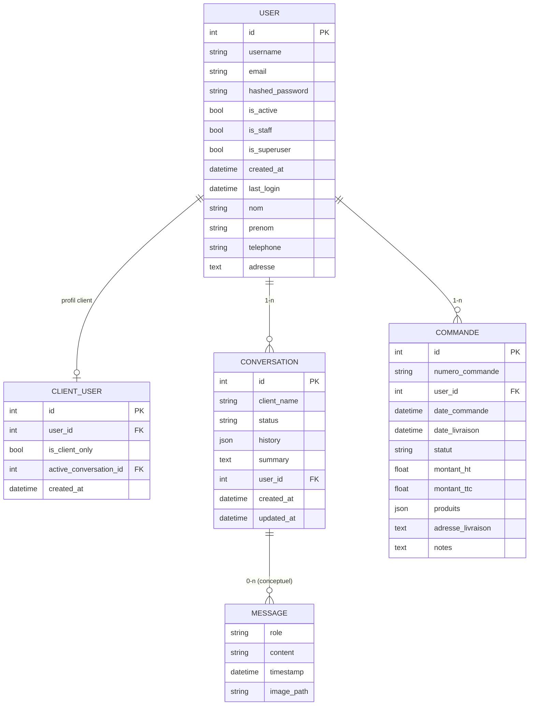

## C14 — Analyse du besoin, spécifications et modélisations (Projet E3‑E4)

Ce document formalise l’analyse du besoin pour l’application « Chatbot SAV » (E3‑E4), ses spécifications fonctionnelles, la modélisation des données et des parcours, ainsi que l’intégration d’objectifs d’accessibilité (WCAG 2.1 AA/RGAA 4.1) dans les critères d’acceptation.

---

### 1) Contexte, périmètre et objectifs

-   Contexte: assistance SAV automatisée pour les clients PROFERM (questions, procédures, suivis) avec supervision par le support (staff/admin).
-   Objectif principal: permettre à un client de dialoguer avec un assistant IA (OpenAI) enrichi par une base documentaire (FAISS) et d’historiser les conversations; permettre aux équipes SAV d’explorer, filtrer et clôturer les conversations.
-   Non‑fonctionnels clés: sécurité (JWT cookies HTTPOnly, rôles), disponibilité (monitoring Prometheus/Grafana), confidentialité (minimisation), performance/coût (max_tokens, FAISS), accessibilité (WCAG 2.1 AA/RGAA 4.1).

Hors périmètre (MVP): gestion de SLA multi‑niveaux, intégration CRM/ITSM, recherche plein‑texte hors FAISS, analytics avancée.

---

### 2) Parties prenantes et rôles

-   Client final (ClientUser): accède au chat, gère ses conversations.
-   Équipe SAV (Staff/Admin): supervise conversations, filtre par statut, consulte les détails, clôture et analyse.
-   Équipe technique: développe, exploite et monitore l’application.

---

### 3) Modélisation des données (formalisme ER)

Modèle conceptuel compatible Merise/ER, aligné sur les entités SQLAlchemy (`User`, `ClientUser`, `Conversation`, `Commande`) et l’historique de conversation stocké en JSON.



Remarques:

-   `MESSAGE` est conceptuel (non table) car les messages sont persistés dans `CONVERSATION.history` (JSON). Le modèle logique est conforme au code de `E3-E4/fastapi/models.py`.

---

### 4) Modélisation des parcours utilisateurs (formalismes graphiques)

#### 4.1. Parcours « Authentification » (login/register/logout)

```mermaid
flowchart TD
    A["Visiteur"] --> B["Page Login"]
    B -->|"Crédentiels valides"| C["Création JWT (cookie HTTPOnly)"]
    C --> D{ "Profil" }
    D -->|"Client"| E["Redirection /client_home ou /chat"]
    D -->|"Staff/Admin"| F["Redirection /dashboard"]
    B -->|"Créer un compte"| G["Page Register (client)"] --> H["Création User + ClientUser"] --> B
    E --> I["Logout"] --> B
    F --> I
```

#### 4.2. Parcours « Chat client »

```mermaid
flowchart TD
    C0["Client connecté"] --> C1["/chat : affiche historique"]
    C1 --> C2["Saisie message / Upload images"]
    C2 --> C3["API /api/chat ou /api/upload_images"]
    C3 --> C4["Validation + Récup. contexte (préprompt, FAISS)"]
    C4 --> C5["Appel LLM (OpenAI) + monitoring"]
    C5 --> C6["Maj CONVERSATION.history + affichage réponse"]
    C6 --> C7{ "Clôturer ?" }
    C7 -->|"Oui"| C8["/api/close_conversation (résumé)"] --> C9["Etat = terminé"]
    C7 -->|"Non"| C2
```

#### 4.3. Parcours « Supervision SAV (admin) »

```mermaid
flowchart TD
    A0["Admin connecté"] --> A1["/dashboard : stats agrégées"]
    A1 --> A2["/conversations : liste filtrable"]
    A2 --> A3["/conversation/{id} : détail"]
    A3 --> A4{ "Changer statut ?" }
    A4 -->|"PUT /api/conversation/{id}/status"| A5["Maj statut"]
    A3 --> A6{ "Clôturer ?" }
    A6 -->|"/api/close_conversation"| A7["Résumé + clôture"]
```

---

### 5) User stories fonctionnelles (alignées avec le projet E3‑E4)

Format: User Story + Critères d’acceptation mesurables, intégrant les objectifs d’accessibilité (WCAG 2.1 AA/RGAA 4.1).

#### US‑01 — Connexion (Client)

-   En tant que client, j’ai besoin de me connecter pour accéder à mon espace.
-   Critères d’acceptation:
    -   Après saisie correcte des identifiants, je suis redirigé vers `/client_home` (ou `/chat`).
    -   En cas d’erreur, un message clair apparaît et la page reste accessible au clavier.
    -   Je peux me déconnecter via l’action « Logout » et suis redirigé vers `/login`.
    -   Technique: token d’accès en cookie `HttpOnly` (`SameSite=Lax`, `Secure` en prod); API protégée sans authent renvoie `401` JSON; page protégée → redirection `/login`.
    -   Accessibilité: champs avec `label` associé, focus visible, contrastes suffisants, navigation clavier sans piège.

#### US‑02 — Envoi de message (Client)

-   En tant que client, j’ai besoin d’envoyer un message pour obtenir une réponse.
-   Critères d’acceptation:
    -   Si j’essaie d’envoyer un message vide, une validation m’en informe et l’API répond `400`.
    -   Ma question et la réponse s’affichent dans la conversation; l’historique est mis à jour.
    -   La réponse tient compte du contexte (préprompts + FAISS + historique de la conversation).
    -   En absence de clé `OPENAI_API_KEY`, l’API retourne `401` avec un message explicite.
    -   Accessibilité: zone de saisie utilisable au clavier, libellé explicite, retour d’état perceptible visuellement et textuellement.

#### US‑03 — Ajout d’images (Client)

-   En tant que client, j’ai besoin de joindre des images pour faciliter le diagnostic.
-   Critères d’acceptation:
    -   Je peux ajouter une ou plusieurs images et voir un aperçu avant envoi.
    -   Si le fichier n’est pas une image (`content_type` ne commence pas par `image/`), un message m’explique quoi faire et l’API répond `400`.
    -   Les chemins des fichiers sont persistés et chaque envoi est historisé dans la conversation.
    -   Accessibilité: contrôle d’upload utilisable au clavier/lecteur d’écran; textes alternatifs si rendu d’images.

#### US‑04 — Clôture de conversation (Client)

-   En tant que client, j’ai besoin de clôturer ma conversation quand tout est réglé.
-   Critères d’acceptation:
    -   Si la conversation ne contient aucun échange réel, elle est supprimée.
    -   Sinon, un résumé est généré et stocké; le statut passe à `terminé`.
    -   Je peux retrouver la conversation clôturée et son résumé ultérieurement.

#### US‑05 — Tableau de bord (Technicien/Staff‑Admin)

-   En tant que technicien, j’ai besoin de visualiser l’activité pour piloter le support.
-   Critères d’acceptation:
    -   Je vois les volumes par statut (nouveau, en cours, terminé) et par période.
    -   Je peux choisir une période; les chiffres se mettent à jour quand je change les filtres.
    -   L’accès est restreint aux rôles `staff/admin`; sinon `403`.
    -   Accessibilité: filtres et graphiques utilisables au clavier, libellés explicites, contrastes suffisants.

#### US‑06 — Liste et détail des conversations (Technicien/Staff‑Admin)

-   En tant que technicien, j’ai besoin de parcourir les conversations pour prioriser mes actions.
-   Critères d’acceptation:
    -   Je filtre par statut; les conversations les plus récentes apparaissent en premier.
    -   J’accède au détail d’un échange, avec l’historique et les éventuelles images.
    -   L’accès au détail est protégé par les rôles; en cas d’absence de droits, retour `403`.

#### US‑07 — Changement de statut (Technicien/Staff‑Admin)

-   En tant que technicien, j’ai besoin de changer le statut d’une conversation.
-   Critères d’acceptation:
    -   Je sélectionne « nouveau », « en cours » ou « terminé » via un sélecteur.
    -   Si je n’ai pas les droits, l’action est refusée avec un message et l’API renvoie `403`.
    -   La date de mise à jour (`updated_at`) est actualisée et visible.
    -   Accessibilité: le sélecteur est utilisable au clavier avec focus visible.

#### US‑08 — Clôture avec résumé (Technicien/Staff‑Admin)

-   En tant que technicien, j’ai besoin de clôturer une conversation et conserver une trace.
-   Critères d’acceptation:
    -   Un résumé est enregistré dans la conversation; le statut passe à `terminé`.
    -   L’action de clôture est notée dans l’historique; l’API répond un succès explicite.
    -   En cas d’indisponibilité de la clé IA, la clôture reste possible sans résumé explicatif (comportement dégradé documenté).

#### US‑09 — Accessibilité (Transverse)

-   En tant qu’utilisateur, j’ai besoin d’une interface simple à lire et utilisable sans souris.
-   Critères d’acceptation:
    -   Je peux tout faire au clavier (WCAG 2.1.1); les éléments sélectionnés ont un focus clairement visible (2.4.7).
    -   Les textes sont lisibles avec des contrastes suffisants (≥ 4.5:1, 1.4.3) et une hiérarchie de titres correcte (1.3.1).
    -   Les images affichées côté UI disposent d’alternatives textuelles pertinentes (1.1.1).
    -   Les erreurs de saisie sont communiquées textuellement et associées aux champs concernés (3.3.1/3.3.3).

---

### 6) Objectifs d’accessibilité (standards et intégration aux US)

-   Standards de référence: WCAG 2.1 niveau AA et RGAA 4.1. Intégration systématique dans les critères d’acceptation de chaque US.
-   Exigences transverses:
    -   Structure sémantique: `header/main/aside/nav`, titres hiérarchisés.
    -   Navigation clavier (2.1.1): toutes les actions sont pilotables au clavier; focus visible (2.4.7).
    -   Couleurs/contrastes (1.4.3): ≥ 4.5:1 pour textes; états focus/hover visibles.
    -   Formulaires (3.3.1/3.3.2): labels associés, messages d’erreurs textuels.
    -   Images (1.1.1): alternatives textuelles lorsqu’affichées côté UI.
    -   Langue du document (`lang="fr"`) et méta viewport pour zoom.

Exemples d’intégration (US → critères):

-   US Chat: « Le champ de saisie est accessible au clavier et le focus est visible (WCAG 2.1.1, 2.4.7). »
-   US Login: « Les erreurs de saisie sont communiquées textuellement et associées aux champs concernés (WCAG 3.3.1/3.3.3). »

---

### 7) Faisabilité technique (synthèse)

-   Stack: FastAPI, SQLAlchemy/PostgreSQL, JWT (passlib/bcrypt, jose), Jinja2/HTML/CSS/JS, LangChain+OpenAI, FAISS, Prometheus/Grafana.
-   Contraintes: gestion des secrets via env; limites de tokens et temps de réponse IA; disponibilité BDD; règles CORS par env.
-   Décisions: `alembic upgrade head` au démarrage; singleton FAISS; cookies `HttpOnly`; handlers 401/404 différenciés API/pages.

---

### 8) Traçabilité (spécification → implémentation → tests)

-   Auth/ACL: `fastapi/auth.py`, routes d’auth dans `fastapi/routes.py`; tests `tests/test_fastapi_endpoints.py`.
-   Conversations/Chat: `fastapi/routes.py` (API chat/upload/close), `models.py` (history JSON); tests `tests/test_openai_api.py`.
-   UI/Accessibilité: `templates/*.html`, `static/css/styles.css`, `static/js/main.js` (navigation clavier, sémantique, responsive).
-   Monitoring: `fastapi/app.py` (métriques), `monitoring_utils.py`, `docker-compose.yml` (Prom/Grafana). Documentation: `MONITORING.md`.

---

### 9) Glossaire (extrait)

-   Conversation: échange structuré client↔assistant, persisté en BDD (messages JSON).
-   FAISS: index vectoriel pour recherche sémantique sur corpus métier.
-   Préprompt: instructions système ajoutées en tête d’historique pour cadrer l’IA.
-   RGAA/WCAG: référentiels d’accessibilité web.

---

### 10) Validation et acceptation

-   La conformité C14 est démontrée par: (1) modélisations ER/flows ci‑dessus; (2) spécifications fonctionnelles avec critères de validation et objectifs d’accessibilité; (3) traçabilité vers le code et les tests existants.
