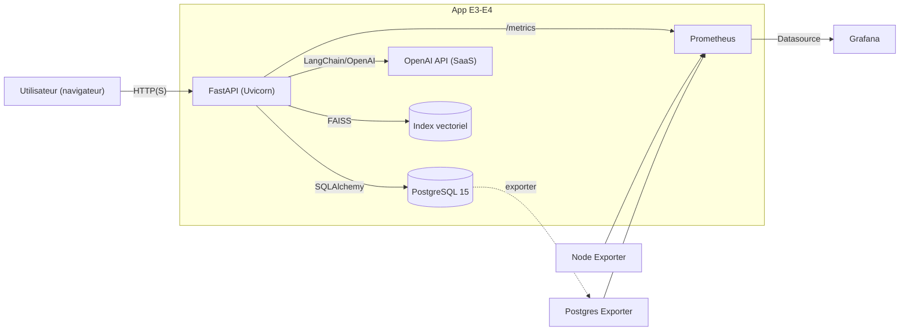

## C15 — Cadre technique et architecture (Projet E3‑E4)

Ce document spécifie le cadre technique de l’application « Chatbot SAV » intégrant un service d’IA, à partir de l’analyse du besoin (C14) pour permettre et sécuriser le développement du projet.

---

### 1) Spécifications techniques (architecture, dépendances, environnements)

#### 1.1 Architecture applicative (vue d’ensemble)



-   Frontend: templates Jinja2 (`templates/*.html`), HTML/CSS/JS, responsive.
-   Backend: FastAPI (Uvicorn), routes web + API, authentification JWT via cookies HTTPOnly, rôles (client/staff/admin), validations Pydantic.
-   Données: PostgreSQL 15 (SQLAlchemy ORM, Alembic migrations), `Conversation.history` en JSON.
-   IA: LangChain + OpenAI (modèle paramétrable), FAISS CPU pour la recherche sémantique.
-   Observabilité: `prometheus_client` exposant `/metrics`, Prometheus + Grafana, exporters Postgres/Node.

Références code:

```82:93:E3-E4/fastapi/app.py
# CORS dynamique selon environnement
app.add_middleware(
    CORSMiddleware,
    allow_origins=cors_allow_origins,
    ...
)
```

```30:31:E3-E4/fastapi/Dockerfile
CMD ["/bin/sh", "-c", "alembic upgrade head && uvicorn app:app --host 0.0.0.0 --port 8000"]
```

```46:63:E3-E4/docker-compose.yml
prometheus, postgres-exporter, grafana et node-exporter provisionnés pour la pré‑prod locale
```

#### 1.2 Dépendances clés (extrait)

-   Web/API: `fastapi`, `uvicorn[standard]`
-   Données: `sqlalchemy`, `psycopg2-binary`, `alembic`
-   Sécurité: `python-jose[cryptography]`, `passlib[bcrypt]`, `python-multipart`
-   Validation/templating: `pydantic[email]`, `jinja2`, `aiofiles`
-   IA: `langchain`, `langchain-openai`, `faiss-cpu`, `pymupdf`
-   Observabilité/tests: `prometheus-client`, `pytest`, `pytest-cov`, `httpx<0.28`

```1:10:E3-E4/fastapi/requirements.txt
fastapi, uvicorn, sqlalchemy, psycopg2-binary, alembic, ...
```

#### 1.3 Environnements d’exécution

-   Développement: variables d’environnement via `.env`, `DEBUG=True`, CORS permissif.
-   Pré‑production (locale): Docker Compose avec services `web`, `db`, `prometheus`, `grafana`, `exporters`. Accès:
    -   API: `http://localhost:8001`
    -   Prometheus: `http://localhost:9090`
    -   Grafana: `http://localhost:3000`
-   Production (cible): même topologie conteneurisée; durcir CORS, secrets, ressources; surveiller `/metrics` en réseau interne.

Variables importantes: `DATABASE_URL`, `SECRET_KEY`, `OPENAI_API_KEY`, `OPENAI_MODEL`, `ADMIN_*`, `ACCESS_TOKEN_EXPIRE_MINUTES`, `ALLOWED_ORIGINS`.

---

### 2) Choix techniques et démarche éco‑responsable

-   Réduction d’empreinte:
    -   Cap de contexte IA: `max_tokens=500`, température faible; privilégier modèles compacts si qualité suffisante.
    -   Réutilisation FAISS (singleton) pour éviter re‑chargements coûteux en CPU/IO.
    -   Monitoring continus (latence p95, tokens) pour maîtriser coût/énergie.
-   Hébergement/outillage:
    -   Favoriser PaaS/SaaS publiant des engagements environnementaux (énergie renouvelable, bilans GES). Documenter le choix fournisseur.
    -   Activer cache HTTP statique et compression au niveau reverse proxy (prod).
    -   Encadrer uploads (tailles/types), politique de rétention des fichiers.
-   Bonnes pratiques dev: minimiser logs bavards, tests ciblés, CI avec caches, nettoyage artefacts.

Indicateurs de suivi: consommation de tokens/jour, latence p95, CPU/mémoire (via node‑exporter), volume DB, volume d’uploads.

---

### 3) Diagramme de flux de données (DFD)

```mermaid
flowchart LR
  subgraph Client
    B1["Formulaires UI (message, images)"]
  end
  subgraph Backend(FastAPI)
    A1["/api/chat"]
    A2["/api/upload_images"]
    A3["/api/close_conversation"]
    A4["Auth JWT (cookies)"]
  end
  DB[(PostgreSQL)]
  VEC[(FAISS Index)]
  OA["OpenAI (SaaS)"]
  PM[Prometheus /metrics]
  GF[Grafana]

  B1 -->|POST| A1
  B1 -->|POST (multipart)| A2
  A1 -->|valider & créer| DB
  A2 -->|stock path & history| DB
  A1 -->|similarity_search| VEC
  A1 -->|prompt+contexte| OA
  OA -->|réponse texte| A1
  A1 -->|append message| DB
  A3 -->|résumé IA si dispo| OA
  A3 -->|maj statut/summary| DB
  Backend -->|métriques| PM --> GF
```

Données personnelles minimisées: identifiants utilisateur, contenu conversationnel; pas de logs de contenu sensibles dans les métriques.

---

### 4) Preuve de concept (pré‑production) — Accessibilité et fonctionnement

Objectif: démontrer bout‑en‑bout le parcours Client↔IA et la supervision Admin, avec observabilité active.

Procédure d’accès rapide (pré‑prod locale):

```bash
cd E3-E4
docker compose up -d --build
# Accéder à l’app: http://localhost:8001 (web)
# Prometheus: http://localhost:9090 ; Grafana: http://localhost:3000
```

Preuve de fonctionnement:

-   Création admin par défaut via variables `ADMIN_*` et connexion.
-   Parcours chat: envoi message → réponse IA; création conversation; upload images.
-   Supervision: stats dashboard, liste/filtre de conversations, mise à jour statut.
-   Observabilité: `/metrics` OK; scrapes Prometheus; panneaux Grafana alimentés.
-   Tests: PyTest couvre application, endpoints et exigences d’accès (401/403).

Critères d’acceptation de la POC (exemples mesurables):

-   p95 latence `/api/chat` < 2 s (sur contexte court) en pré‑prod locale.
-   Taux d’erreur OpenAI < 5% sur 5 minutes; erreurs 5xx globales < 1%.
-   Consommation tokens moyenne/chat < seuil défini (suivi Grafana).

---

### 5) Conclusion de POC — Aide à la décision

Synthèse:

-   La topologie conteneurisée (web+db+observabilité) est stable en pré‑prod locale.
-   Les parcours critiques (auth, chat, clôture, supervision) sont fonctionnels et testés.
-   Les métriques clés sont disponibles pour piloter latence/coût.

Avis proposé:

-   GO sous conditions:
    -   Valider en environnement cible les seuils p95 (< 2 s) et taux d’erreurs (< 1% 5xx) sur charge nominale.
    -   Confirmer la politique d’uploads (taille/rétention) et le choix fournisseur IA au regard de critères éco‑responsables et contractuels.
    -   Ajouter limites de ressources conteneurs et cache statique côté reverse proxy en prod.

Points d’attention pour itération suivante:

-   Backoff/retry + timeouts explicites pour les appels IA.
-   Étendre tests de charge et scénarios d’accessibilité (lecteur d’écran, clavier).
-   Prévoir anonymisation/pseudonymisation si export des historiques.
